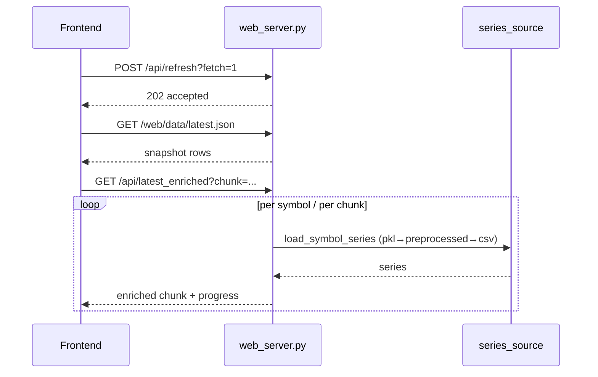

# Crypto Screener 网页数据流与性能优化流程（V1.2）

> 本文以仓库当前实现为准：`apps/crypto_screener` + `数据获取` + `linux_deploy`。目标是把“性能优化方案”落到可执行、可验证、可回滚的工程流程上。

## 修订记录区块（V1.2）

- 修订时间：2026-03-09
- 修订范围：`apps/`、`数据获取/`、`linux_deploy/` 全量审查 + 本文结构化回填
- 与代码现状不符项（已标记为“待实现”）：
  - 待实现：服务端缓存 LRU/TTL。当前代码仍是“超阈值全清”（`series_cache.clear()` / `enriched_cache.clear()`）。
  - 待实现：`/api/latest_enriched` 的 `fields/include_debug` 轻量协议。
  - 待实现：`QC_ENRICHED_CHUNK_SIZE`、`QC_DISABLE_SCHEDULER`、`QC_SCHED_OFFSET_MINUTES` 配置开关。
  - 待实现：前端 `requestIdleCallback` 分帧渲染或虚拟滚动。
- 已有能力（与文档一致）：
  - 已完成：`/api/latest_enriched` 分批返回（chunk）与前端进度条。
  - 已完成：数据源回退链路 `pkl -> preprocessed -> csv` 与新鲜度探测。
  - 已完成：`/api/status` 与 `/api/metrics` 基础状态与缓存规模指标。
- 新增交付：
  - `apps/crypto_screener/OPTIMIZATION_CHECKLIST.md`
  - `linux_deploy/optimization_validation.py`
  - `linux_deploy/perf_report_template.md`

## 0. 术语与产物约定

- 快照：`apps/crypto_screener/web/data/latest.json`（列表主数据）、`apps/crypto_screener/web/data/meta.json`（更新元信息）
- 合并后的 K 线 CSV：默认 `数据获取/data/{swap_lin,spot_lin}/*.csv`（也可能被环境变量指向外部目录）
- 小时分区预处理：`QC_PREPROCESS_OUT_ROOT/{swap|spot}/YYYY/MM/DD/HH/*.parquet` + `manifest.json`
- PKL Cache：`{QC_PKL_CACHE_ROOT 或 QC_PREPROCESS_OUT_ROOT/pkl_cache}/series_{swap|spot}.pkl`、`factors_{swap|spot}.pkl`

## 1. 现状分析（架构评估）

### 1.1 当前端到端链路
- 数据更新链路：`POST /api/refresh?fetch=1`（返回 202，后台线程执行）→ `start_update()` → `_run_update()` → `run_once(fetch)` 生成 `latest.json/meta.json` → `run_incremental_catchup`（预处理 catchup）→ 可选异步 `pkl_cache` 构建。
- 页面刷新链路：前端先请求 `/api/refresh` 启动更新，再读快照（静态兜底）；若启用动态指标/自定义因子，再调用 `/api/latest_enriched` 分批计算并返回 enriched 结果。
- 单币 K 线链路：前端 `GET /api/kline` 请求单币，后端按 `pkl_cache -> preprocessed -> csv` 回退读取（见数据源分层策略）。
- 当前已上线能力：`latest_enriched` 已支持分批（chunk）返回，前端已支持分批拉取与进度条显示。

### 1.2 代码与脚本映射（以“可定位/可复现”为原则）

- Web 服务入口：`apps/crypto_screener/app/web_server.py`
- Pipeline 编排：`apps/crypto_screener/app/pipeline.py`（含 `.pipeline.lock` 防重入，生成快照由 `generate_snapshot.py` 完成）
- 数据获取一键链路：`数据获取/0_一键执行获取合并.py`（内部串联抓取与合并）
- 增量预处理：`数据获取/incremental_update.py`（支持 catchup、写 metrics/alerts 日志）
- 小时分区预处理实现：`数据获取/preprocess_fast.py`（CSV→分区 Parquet/Pickle + manifest）
- PKL Cache 构建：`数据获取/factor_cache_update.py`（可增量并发，生成 `series_*.pkl`/`factors_*.pkl`）
- Linux 启动/更新脚本：`linux_deploy/run_web.sh`、`linux_deploy/run_update_once.sh`、`linux_deploy/README.md`

### 1.3 数据源分层与“新鲜度”判断（避免隐性回退）

- 运行时读取优先级：`pkl_cache -> preprocessed -> csv`（`QC_USE_PKL_SERIES_CACHE`、`QC_USE_PREPROCESSED_SERIES` 控制）
- 合并 CSV 的默认目录：
  - Linux：默认 `数据获取/data/{swap_lin,spot_lin}`（也可由 `QC_MERGE_{SWAP|SPOT}_PATH` 或 `QC_SCREENER_FALLBACK_{SWAP|SPOT}_DIR` 覆盖）
  - Windows：默认回落到 `D:\量化交易\data\{swap_lin,spot_lin}`（若未配置环境变量）
- PKL 新鲜度探测：当 `QC_PKL_REQUIRE_FRESH=1` 时，会 probe CSV tail 的最后时间与 PKL 对比；若判 stale，会回退到 CSV/预处理路径（该 probe 可能在高并发下变成隐性 IO 热点）。

### 1.4 调度现状与风险点（必须在文档中定“唯一权威”）

- Web 服务内置整点调度：`web_server.py` 启动后常驻线程每小时触发一次 `start_update(fetch=True)`
- Linux 部署文档建议的 cron：每小时 05 分跑一次 `数据获取/incremental_update.py --once`
- 当前状态下两套节奏可能并存，风险包括：重复 IO/CPU、并发写盘竞争、更新状态口径不一致、以及“页面看到的更新完成”与“预处理完成”不同步。

推荐策略（先落地、少改代码）：

- 线上先采用“Web 服务内置整点更新为权威调度”，cron 只保留为兜底手动/应急运行，不作为常态。
- 若确需 05 分更新：建议二期在 `web_server.py` 增加 `QC_SCHED_OFFSET_MINUTES` / `QC_DISABLE_SCHEDULER` 等开关，避免双跑。

### 1.5 数据流与时序图（Mermaid）

数据更新链路（抓取→快照→预处理→PKL，可选）：

```mermaid
flowchart LR
  subgraph Web[apps/crypto_screener]
    A[POST /api/refresh<br/>或内置整点调度] --> B[start_update(fetch)]
    B --> C[_run_update]
    C --> D[run_once(fetch)]
    D --> E[generate_snapshot.py<br/>写 latest.json/meta.json]
    C --> F[run_incremental_catchup<br/>增量预处理]
    C -->|QC_BUILD_PKL_CACHE=1| G[build_market_cache<br/>异步]
  end
  subgraph Data[数据获取]
    H[0_一键执行获取合并.py] --> I[合并后 CSV<br/>swap_lin/spot_lin]
    F --> J[preprocess_fast.py<br/>小时分区 manifest]
    G --> K[pkl_cache<br/>series_*.pkl / factors_*.pkl]
  end
  D --> H
  I --> J
  I --> K
  J --> K
```

页面刷新链路（快照兜底 + enriched 分批）：



### 1.6 是否“最优方案”的结论
- **结论：当前方案不是最优，但已具备可演进基础。**
- 主要问题不是计算公式复杂，而是“全市场规模 × 多币序列装载 × 同步串行请求”的系统性开销。
- 当前架构具备清晰分层（快照、序列读取、enriched 计算、前端渲染），适合继续优化，不建议推倒重做。

---

## 2. 性能瓶颈定位

### 2.1 已观测问题
- 主页出现 `因子计算降级：status=504`，说明 `/api/latest_enriched` 请求超时。
- 单币 K 线正常，说明数据源本身可用；瓶颈在“批量 enriched 计算链路”，不是单币读数据。
- 预处理链路存在“配置/依赖异常时静默失败”风险，导致长期走 CSV fallback。
- 基线压测（`app/perf_outputs/http_bench_small.json`）：
  - `users=1`：`avg=20030ms`、`P95=20038ms`、错误率 `100%`
  - `users=10`：`avg=20537ms`、`P95=21045ms`、错误率 `100%`
  - `users=100`：`avg=20304ms`、`P95=21542ms`、错误率 `100%`
- 基线资源（同文件）：
  - 进程 RSS 约 `3.2GB ~ 4.0GB`
  - 请求吞吐约 `0.15 ~ 2.92 qps`

### 2.2 核心瓶颈点
- **B1：服务端批处理时延大**
  - `/api/latest_enriched` 对大量币种逐个取 series、算指标、算表达式；I/O+CPU 叠加，峰值请求易超时。
- **B2：缓存命中策略不够稳定**
  - 缓存清理采用“超阈值全清”，存在抖动；高峰期冷热切换频繁。
- **B3：前端渲染全量同步**
  - 表格全量渲染 + 列计算在主线程，滚动和交互会被大批 DOM 更新影响。
- **B4：更新状态可观测性不足**
  - 过去预处理失败容易被吞；虽已补 `last_error_preprocess`，但仍需标准化指标和告警。
- **B5：调度重复导致重复计算/写盘**
  - Web 内置整点更新与 cron 05 分预处理若同时启用，会在同一小时窗口内重复读取/写入与竞争资源。
- **B6：PKL 新鲜度探测在高并发下可能变成隐性 IO 热点**
  - `QC_PKL_REQUIRE_FRESH=1` 时的 CSV tail probe 在并发请求下会放大磁盘读取与锁竞争。

---

## 3. 优化目标（量化）

> 以“市场=all，结果规模约 900~1300，开启 StochRSI + 1~3 个自定义因子”为标准场景。

### 3.1 用户体验目标
- 首屏可见（快照渲染）：**P95 ≤ 1.2s**
- enriched 完整可用（含因子列）：**P95 ≤ 4.0s，P99 ≤ 6.0s**
- 手动刷新交互响应（按钮→进度可见）：**≤ 200ms**

### 3.2 系统资源目标
- web_server 单实例 CPU 峰值：**降低 30%+**
- `/api/latest_enriched` 504 比例：**< 0.5%**
- 单次 enriched 请求平均 payload：**降低 20%+**

### 3.3 维护与扩展目标
- 新增指标/因子无需改动主链路协议（保持扩展字段兼容）。
- 核心链路具备“可观测性三件套”：请求耗时、阶段耗时、降级原因。

---

## 4. 具体改进措施

### 4.1 数据缓存策略优化
- 服务端缓存由“超阈值全清”改为 **LRU**（按 key 淘汰，不引入第三方依赖）。
- 对 `series_cache/enriched_cache` 增加：
  - TTL（例如 30~120s）
  - 最大对象大小限制
  - 分市场分桶（spot/swap）以降低相互污染。
- `latest_enriched` 返回中携带 `etag` 与 `chunk` 元信息，前端支持增量复用。

### 4.2 异步计算拆分（核心）
- 将 enriched 拆成三个阶段：
  - S1：快照即刻展示（当前已具备）
  - S2：分批 enriched 计算（当前已具备，继续优化并发）
  - S3：后台预热下一轮热点币（基于最近命中列表）
- chunk 调度策略：
  - 默认 `chunk_size=200`，自动根据上一次耗时自适应（100~300）
  - 并发度建议 2（并发过高会放大 CPU 抖动）
  - 失败重试 1 次，超时则局部降级而非全量失败。

### 4.3 前端渲染优化
- 表格渲染改为“分段提交”：
  - 首批渲染前 100 行，剩余 `requestIdleCallback` 分帧插入。
- 指标列计算和格式化前置到数据准备阶段，渲染阶段仅做赋值。
- 对高频刷新状态文本、进度条更新做节流（100~150ms）。
- 保持“进度条 + 降级原因”可见，避免误判为数据缺失。

### 4.4 后端接口聚合与协议优化
- `/api/latest_enriched` 增加轻量模式：
  - `fields=...`（只返回当前页面可见列）
  - `include_debug=false`（默认关闭额外字段）
- 新增 `/api/enriched_job`（可选二期）：
  - 提交任务 → 返回 job_id
  - 前端轮询 job 状态与分片结果
  - 彻底规避长连接超时问题。

### 4.5 预处理与 pkl 侧修复
- 强制启动自检：
  - 启动时检查 `QC_USE_PREPROCESSED_SERIES`、`pyyaml`、`output_root` 一致性。
- pkl 构建参数合理化：
  - `QC_PKL_CACHE_TAIL` 不低于前端 tail（建议 720~2160）
  - 构建后写入 `symbols_count/max_dt`，供 runtime 快速判断新鲜度。

### 4.6 基准与诊断（把“优化是否有效”变成日常动作）

- 统一用基准脚本对比四条路径：baseline(csv) / preprocessed / pkl_series / pkl_series_factor
  - `linux_deploy/bench_factor_pipeline.py`
- 用诊断脚本把“数据链路跑通”固化成一键自检：
  - `linux_deploy/diag_data_flow.py`（从数据源到快照的链路检查）
  - `linux_deploy/diag_latest_json.py`（快照产物检查）
  - `linux_deploy/diag_kline_source.py`、`linux_deploy/diag_live_kline_api.py`（K 线读取/接口自检）
  - `linux_deploy/smoke_pkl_cache.py`（PKL cache 基本可用性）

### 4.7 优化清单（用于评审/上线前核对）

- 缓存：
  - series/enriched/gzip 缓存具备“按 key 淘汰”，不再全清
  - 缓存容量、TTL、分桶策略已参数化并记录在 `/api/metrics`
- 接口：
  - `/api/latest_enriched` 支持按需字段裁剪（fields/include_debug）
  - 分批（chunk）失败可局部降级，不拖垮整批
- 前端：
  - 表格分帧渲染或虚拟滚动（行数高时自动启用）
  - 进度条/状态更新节流，避免过度重绘
- 数据链路：
  - 预处理输出目录、manifest、自检脚本均可一键验证
  - 线上只有一个自动更新权威调度（避免双跑）

### 4.8 差异修订建议（含代码示例/配置片段/测试用例/验收标准）

#### 建议 A：缓存从“全清”改为“按键淘汰”
- 影响优先级：性能 P0、可维护性 P1、安全性 P2
- 现状证据：`series_cache` 和 `enriched_cache` 触顶后执行 `.clear()`
- 代码示例（后端）：

```python
from collections import OrderedDict
import time

class TTLCache:
    def __init__(self, max_items=2000, ttl_sec=90):
        self.max_items = max_items
        self.ttl_sec = ttl_sec
        self.store = OrderedDict()

    def get(self, key):
        item = self.store.get(key)
        if not item:
            return None
        ts, payload = item
        if time.time() - ts > self.ttl_sec:
            self.store.pop(key, None)
            return None
        self.store.move_to_end(key)
        return payload

    def put(self, key, payload):
        self.store[key] = (time.time(), payload)
        self.store.move_to_end(key)
        while len(self.store) > self.max_items:
            self.store.popitem(last=False)
```

- 配置片段（env）：

```bash
QC_SERIES_CACHE_MAX=3000
QC_SERIES_CACHE_TTL_SEC=120
QC_ENRICHED_CACHE_MAX=1200
QC_ENRICHED_CACHE_TTL_SEC=60
```

- 测试用例：
  - 单测：写入 `max+1` 个键，断言最老键被淘汰而非全清。
  - 集成：连续 2000 次请求后缓存命中率不低于首轮 warmup 的 70%。
- 验收标准：
  - `/api/latest_enriched` P95 从基线下降 **≥50%**
  - 进程 RSS 峰值下降 **≥15%**
  - 缓存 miss 抖动峰值下降 **≥40%**

#### 建议 B：增加字段裁剪协议，降低序列化成本
- 影响优先级：性能 P0、可维护性 P1、安全性 P2
- 现状证据：`/api/latest_enriched` 尚未支持 `fields/include_debug`
- 代码示例（后端）：

```python
fields_raw = (qs.get("fields", [""])[0] or "").strip()
allow = {"symbol", "name", "rank", "chg", "stoch_rsi_k", "stoch_rsi_d"}
wanted = {x.strip() for x in fields_raw.split(",") if x.strip()} if fields_raw else set()
if wanted:
    wanted &= allow
    rows2 = [{k: v for k, v in row.items() if k in wanted or k.startswith("_")} for row in rows2]
include_debug = (qs.get("include_debug", ["0"])[0] or "0") == "1"
if not include_debug:
    for row in rows2:
        row.pop("_debug", None)
```

- 配置片段（前端请求）：

```text
/api/latest_enriched?...&fields=symbol,rank,chg,stoch_rsi_k,stoch_rsi_d&include_debug=0
```

- 测试用例：
  - 接口测试：请求 5 列时，响应结果中不存在额外业务列。
  - 回归测试：不传 fields 时，响应与旧协议字段兼容。
- 验收标准：
  - 单次 enriched payload 大小下降 **≥20%**
  - JSON 编码阶段耗时下降 **≥25%**

#### 建议 C：前端分帧渲染，避免主线程长阻塞
- 影响优先级：性能 P0、可维护性 P1、安全性 P3
- 现状证据：`renderTable` 仍是全量同步 `tbody.appendChild`
- 代码示例（前端）：

```javascript
function renderTableChunked(rows, fields, size = 100) {
  const tbody = $("tbody");
  tbody.innerHTML = "";
  let i = 0;
  const run = (deadline) => {
    while (i < rows.length && (deadline.timeRemaining() > 4 || deadline.didTimeout)) {
      const end = Math.min(i + size, rows.length);
      for (; i < end; i += 1) tbody.appendChild(buildRow(rows[i], fields));
    }
    if (i < rows.length) requestIdleCallback(run, { timeout: 80 });
  };
  requestIdleCallback(run, { timeout: 80 });
}
```

- 配置片段（前端参数）：

```text
QC_UI_FIRST_BATCH_ROWS=100
QC_UI_RENDER_CHUNK_ROWS=100
```

- 测试用例：
  - Lighthouse/Performance：长任务（>50ms）数量减少。
  - E2E：排序、选中行、K线跳转在分帧渲染后行为不变。
- 验收标准：
  - 首屏可见时间（P95）**≤1.2s**
  - 可交互时间（TTI）下降 **≥35%**

#### 建议 D：统一调度权威，避免双跑
- 影响优先级：性能 P1、可维护性 P0、安全性 P2
- 现状证据：Web 内置整点 + 文档建议 cron 05 分并存风险
- 配置片段（建议新增）：

```bash
QC_DISABLE_SCHEDULER=0
QC_SCHED_OFFSET_MINUTES=0
QC_CRON_MODE=fallback_only
```

- 测试用例：
  - 运行 24 小时，检查每小时只出现一次自动更新任务。
  - 压测窗口中 `.pipeline.lock` 冲突次数为 0。
- 验收标准：
  - 重复更新次数下降到 **0**
  - 更新完成口径（`/api/status` 与 `meta.json`）一致率 **100%**

#### 建议 E：部署安全基线修订
- 影响优先级：性能 P3、可维护性 P1、安全性 P0
- 现状证据：`env.example` 存在明文 SMTP 密码；`run_web.sh` 支持任意 `QC_ENV_FILE` source
- 配置片段（修订后）：

```bash
QC_SMTP_PASS=__REPLACE_WITH_SECRET_MANAGER__
QC_ALLOWED_ENV_PREFIX=/etc/qc_screener/
QC_SCREENER_HOST=127.0.0.1
```

- 测试用例：
  - 安全扫描：仓库中不再出现真实密钥模式。
  - 启动验证：非法 `QC_ENV_FILE` 路径被拒绝并输出错误。
- 验收标准：
  - 秘钥明文文件数降为 **0**
  - 部署安全审计高危项清零

---

## 5. 实施步骤（分阶段）

### Phase 0（已完成）
- 分批 enriched + 前端进度条 + 降级提示。

### Phase 1（开发）
- 截止时间：2026-03-13
- 责任人：后端负责人（API/缓存）、SRE 负责人（部署变量）
- 任务：
  - 缓存淘汰策略由全清改 LRU+TTL。
  - 新增 `fields/include_debug` 协议参数。
  - 补充 `QC_DISABLE_SCHEDULER/QC_SCHED_OFFSET_MINUTES` 并设置单一权威调度。

### Phase 2（单元测试）
- 截止时间：2026-03-15
- 责任人：后端负责人、测试负责人
- 任务：
  - 缓存淘汰/TTL/字段裁剪单元测试覆盖。
  - 协议兼容测试（旧请求不传 fields 的回归）。

### Phase 3（集成验证）
- 截止时间：2026-03-17
- 责任人：测试负责人、前端负责人
- 任务：
  - 前后端联调：分帧渲染 + chunk 请求 + 降级路径。
  - 运行自动化自检脚本与性能基线脚本，输出报告。

### Phase 4（灰度发布）
- 截止时间：2026-03-19
- 责任人：SRE 负责人、安全负责人
- 任务：
  - 10% 流量灰度，持续观察 24h。
  - 核验 504 比例、P95、内存峰值与告警噪音。

### Phase 5（全量上线）
- 截止时间：2026-03-21
- 责任人：项目负责人（批准）、SRE 负责人（执行）
- 任务：
  - 全量切流并冻结配置。
  - 执行上线后 48h 稳定性复盘与文档回填。

---

## 6. 性能基准测试方案

### 6.1 测试环境
- 线上同规格机器（或同 CPU 核数、同磁盘类型）。
- 固定数据快照（同一时间窗口），避免行情波动干扰。

### 6.2 场景定义
- Case A：仅快照渲染（无动态指标）
- Case B：StochRSI 开启
- Case C：StochRSI + 3 个自定义因子
- Case D：市场 all + 排序切换 + 手动刷新

### 6.3 采样指标
- 前端：
  - TTFP、首屏可交互时间、列表可滚动时间
  - 进度条完成时长（enriched done）
- 后端：
  - `/api/latest_enriched` P50/P95/P99
  - 504 比例、单位时间 CPU/内存峰值
  - 缓存命中率（series/enriched）

### 6.4 验收阈值
- 满足第 3 节量化目标全部阈值。
- 连续 24h 压测+真实流量观测无明显回退。

---

## 7. 上线验证标准

### 7.1 功能正确性
- 单币 K 线、主页指标、自定义因子结果与离线脚本一致（抽样 30 币）。
- 降级场景可复现且提示清晰（status/原因可见）。

### 7.2 性能稳定性
- 高峰时段 `/api/latest_enriched` 无连续 504。
- 进度条从 0→100% 可观察，且完成后自动刷新结果。

### 7.3 可观测性
- `/api/status` 能看到 update/pkl/preprocess 状态和错误。
- `/api/metrics` 可区分快照渲染时延与 enriched 时延。

---

## 8. 回滚预案

### 8.1 触发条件
- 线上 30 分钟内 504 比例 > 5%
- 首屏时间劣化 > 30%
- 出现大面积空列/错误列

### 8.2 回滚动作
- 前端回滚到“仅快照+手动因子刷新”策略（关闭 chunk 并发）。
- 后端关闭 enriched 分片增强参数，恢复旧接口行为。
- 强制开启快照兜底展示，确保交易列表可用。

### 8.3 数据一致性保障
- 回滚不改历史数据，仅切换计算与返回策略。
- 保留 pkl/preprocessed 文件，不执行删除操作。

---

## 9. 推荐配置基线（上线初始值）

- `QC_USE_PREPROCESSED_SERIES=1`
- `QC_USE_PKL_SERIES_CACHE=1`
- `QC_PKL_CACHE_TAIL=2160`
- `QC_PKL_REQUIRE_FRESH=1`
- `QC_PREPROCESS_REQUIRE_FRESH=1`
- `QC_ENRICHED_CHUNK_SIZE=200`（建议新增）
- `QC_PREPROCESS_LAG_HOURS=1`
- `QC_PREPROCESS_MAX_HOURS_PER_RUN=24`
- nginx:
  - `proxy_read_timeout 300s`
  - `proxy_send_timeout 300s`
  - `proxy_connect_timeout 60s`

---

## 10. 总结

- 当前方案不是“最优”，但方向正确：快照兜底 + 分批 enriched + 多级数据源回退。
- 下一步的关键不是继续堆算力，而是做“**可观测 + 分层异步 + 渲染分帧 + 缓存精细化**”。
- 按本文分阶段落地后，可在首屏、交互、资源占用三项核心指标上实现可量化提升，并保持后续可维护与可扩展。
